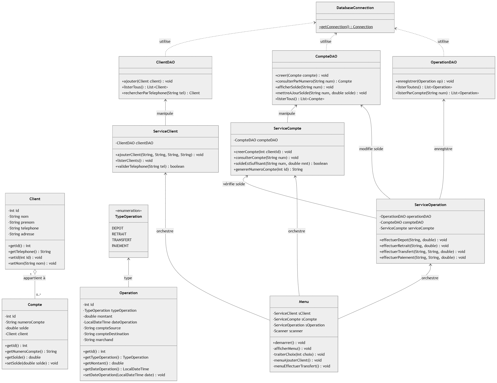

# DESCRIPTION DU PROJET

Simulation Mobile Money est une application console de **gestion financière** développée en **Java** avec une persistance des données sous **MySQL**. Elle simule les fonctionnalités essentielles d'un service de Mobile Money (Dépôts, Retraits, Consultation).

---

L'objectif de cette application est de fournir une plateforme robuste pour gérer de manière automatisée et sécurisée les interactions financières des clients. Le système repose sur une architecture **DAO (Data Access Object)** pour garantir une séparation claire entre la logique métier et le stockage des données.

## **Architecture Technique**
Le projet est structuré en plusieurs couches :
* **Model** : Représentation des entités métier (**Client**, **Compte**, **Operation**).
* **DAO** : Gestion de la persistance des données via **JDBC**.
* **Database** : Connexion centralisée à MySQL via le pattern **Singleton**.

## **Modélisation UML**
Le système a été conçu en respectant les principes de la **POO**. Voici le diagramme de classes qui sert de base au développement :



---

#  INSTRUCTIONS D'INSTALLATION**

## **Prérequis**
* **Java JDK 17+** installé.
* **XAMPP** (pour MySQL et phpMyAdmin).
* Pilote JDBC : **`mysql-connector-j-9.5.0.jar`** (placé dans le dossier `/lib`).

## **Configuration de la Base de Données**
1. Démarrez les modules **Apache** et **MySQL** via le panneau de contrôle XAMPP.
2. Créez une base de données nommée `simulation_mobile_money`.
3. Importez le script SQL :
   ```sql
   SOURCE database.sql;

# EXEMPLES D'UTILISATION

Voici les principaux flux d'utilisation de l'application 

## Scénario A : Enregistrement d'un nouveau client
* **Action** : Choisir l'option "Créer un Client".
* **Entrées** : Nom (ex: DIA), Prénom (ex: Abdou), Téléphone (ex: 77XXXXXXX).
* **Résultat** : Un message confirme l'ajout en base et le système génère automatiquement un numéro de compte associé.

## Scénario B : Réalisation d'un dépôt
* **Action** : Sélectionner "Faire un dépôt".
* **Entrées** : Numéro de compte cible et montant (ex: 25 000 FCFA).
* **Effets en base** :
    * Le solde du compte est incrémenté.
    * Une ligne est ajoutée dans la table `operation` avec le type **DEPOT** et l'horodatage précis.

## Scénario C : Consultation de l'historique
* **Action** : Sélectionner "Historique des opérations".
* **Entrée** : Numéro du compte.
* **Affichage** : Un tableau listant toutes les transactions passées pour vérifier les flux financiers en temps réel.

---

# Stack Technique

* **Langage** : Java
* **Base de données** : MySQL (via XAMPP)
* **Connecteur** : JDBC (Java Database Connectivity)
* **Conception** : UML 2.0 (réalisé avec Draw.io)

---

# Équipe de développement (ESP)

Projet réalisé par l'équipe :
* **Diarra DIA**
* **Dieynaba BALDE**
* **Astou**
* **Rokhaya GUEYE**

**Formation** : DUT2 Informatique - École Supérieure Polytechnique de Dakar
